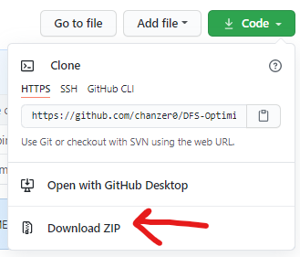
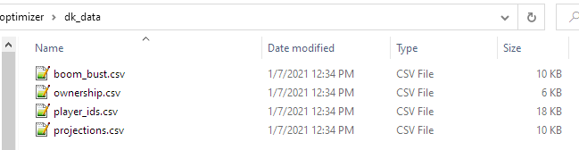
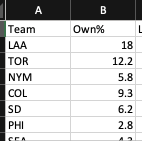
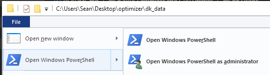
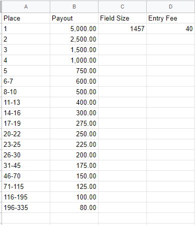
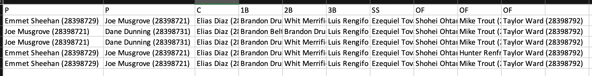
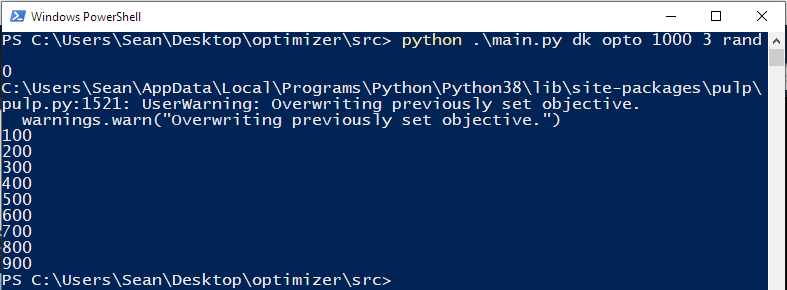
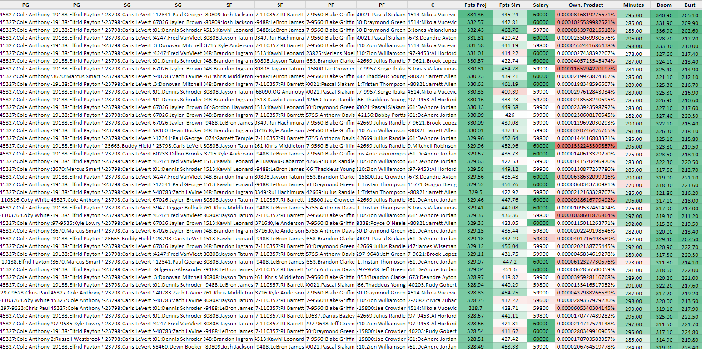
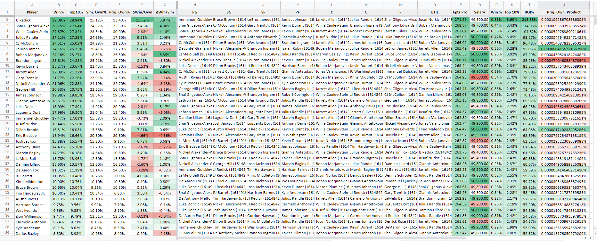

#  Optimizer and GPP Utilities

Packaged in this repository is an MLB GPP Simulator for DraftKings (with FanDuel on the way), along with other tools you might find useful in helping you win your Cash games, Head-to-heads and Tournaments. You'll find installation and usage instructions below.

This tool was created in conjunction with [@bjungwirth](https://github.com/bjungwirth) who is knowledgeable in both DFS game theory as well advanced python data science and data strucures. You can check him out on [Twitter](https://twitter.com/blainejungwirth?lang=en) or read [his blog.](http://http://jungwirb.io/)

## Installation

If you're lazy and don't like reading, you can check this video which covers _most_ everything listed below. Note that this video concerns our NBA-DFS-Tools repo, so treat the README as gospel.
[](https://www.youtube.com/watch?v=5r3_n9qrZ0Y "NBA-DFS-Tools Installation and Usage Guide")

### System requirements

-   To run the tools, you will need to [install python](https://www.python.org/downloads/) if you don't already have it. These tools were bult on Python >=3.8.2, and may be incompatible with outdated versions of Python.
-   In addition to the base python installation, you will need the following packages:
    -   [PuLP](https://pypi.org/project/PuLP/) - `pip install pulp`. This is the linear programming solver - the "optimizer" if you will.
    -   [timedelta](https://pypi.org/project/timedelta/) - `pip install timedelta`. This package makes it easy to interpret dates for late swaptimizing lineups.
    -   [pytz](https://pypi.org/project/pytz/) - `pip install pytz`. Another helpful package for interpreting dates and late swaptimizing
    -   [numpy](https://pypi.org/project/numpy/) - `pip install numpy`. This package makes data manipulation and handling matrices easier.
    -   [pandas](https://pypi.org/project/pandas/) - `pip install pandas`. This package converts pythonic data structures (dicts, lists, etc) to more familiar tabular data structures.

To install these tools, you may either clone this repository or download the repository as a ZIP file (see image below) and extract it to the directory of your choosing.



After you have cloned or downloaded the code base, you must import player contest data from DraftKings or FanDuel. Reference the screenshots below for your relative site. You will need to rename these files to `player_ids.csv`, and place into their relative directory (`dk_data/` or `fd_data/`). These directories should be folders located in the same directory as `src/` and `output/`, and will hold relevant data for each site.

After you have the player data, you must import data from your trusted DFS site, namely the projections, ownership, standard deviation, and field stacks (for MLB). Download them as CSV, and rename them to match the image below. These will go in either `dk_data/` or `fd_data/` depending on which data you downloaded.



Save stack ownership in the file `team_stacks.csv` with the columns "Team" and "Own%" where "Team" is the team abbreviation for each team (e.g. 'LAA') and "Own%" is what percentage of the field uses that stack.



## Usage

To use the tools, you will need to open a windows console or powershell terminal in the same directory as this repository. To do this, go to the root directory and then navigate to `File > Open Windows Powershell` as seen below.



To run the tools, the generic usage template is as follows:
`python .\main.py <site> <process> <num_lineups> <num_uniques>`

Where:
`<site>` is:

-   `dk` for DraftKings. Note for DraftKings, players are output in alphabetical order and must be re-ordered into their positions before uploading back to DK. Note for DraftKings, if you run into any KeyErrors on player names (e.g. Matthew Fitzpatrick vs Matt Fitzpatrick) you must also run `python .\name_change.py` before any crunching/simulating, as some player names differ between projections and DraftKings's player data
-   `fd` for FanDuel. Note for FanDuel, you must also run `python .\name_change.py` before any crunching, as some player names differ between projections and FanDuel's player data

`<process>` is:

-   `opto` for running optimal lineup crunches, with or without randomness
-   `sim` for running GPP simulations

    -   Usage #1 allows you to run arbitrary simulations for any field size and number of iterations, without regards to a real contest structure. The usage for this is: `python .\main.py <site> sim <field_size> <num_iterations>`, where `<field_size>` is the known entrant size, `<num_iterations>` is the number of times you wish to simulate the tournament.

    -   Usage #2 allows you to specify an actual DraftKings contest, which will dictate `<field_size>`. You will specify the number of iterations, but specifying the contest allows the simulation to take ROI into account, since the payout structure and entry fee is known. The usage for this is: `python .\main.py <site> sim cid <num_iterations> <match>`. To execute this usage, you will need a `contest_structure.csv` file in the structure of the image shown below. You can obtain this fairly quickly by opening up the contest details overlay and copy/pasting the prize payouts section into Excel or Google sheets, then using `Ctrl+H` to get rid of 'st', 'nd', 'rd', 'th', etc...

        

        -   Additionally, you may opt to upload lineups from a file rather than have them randomly generated/simulated. To specify this option, you will add `file` as a flag in your command like so: `python .\main.py <site> sim cid file 10000`. You must have an input file called `tournament_lineups.csv` in the base input directory. This allows you to upload specifically-tailored lineups that you feel are more representative of your contest than the ones generated. It also has the added benefit of being much faster than generating lineups. For example, you may take the output of the `opto` process, and rename the file to `tournament_lineups.csv`, and use those as your input for the `sim` process. The simulator will now automatically generate the difference between the number of lineups in the `tournament_lineups.csv` file and the `<field_size>` parameter from either the `contest_structure.csv` or the shell prompt.

        The `tournament_lineups.csv` file requires ten columns, one for each player in a (draftkings) lineup. Players can either have their full name or full name and player id in parentheses.

        

-   `sd` for running showdown crunches, with or without randomness

`<num_lineups>` is the number of lineups you want to generate when using the `opto` process.

`<num_uniques>` defines the number of players that must differ from one lineup to the next. **NOTE** - this is enforced _after_ crunching, so 1000 lineups may be whittled down to 7-800 depending on this constraint. Enforcing this _after_ crunching aids in the speed of crunching. Expect approximately 5-15% of lineups to be "culled" by this constraint and plan accordingly. The more players available to crunch, the lower this percentage will be.

For example, to generate 1000 lineups for DraftKings, with 3 uniques and randomness, I would execute the following:
`python .\main.py dk opto 1000 3` with `"randomness": X` in `config.json` where `X` is a number between 0 and 100

The image below shows what the shell/terminal should look like when executing this. You may safely ignore the PuLP overwriting warning, as we must overwrite the linear programming objective with the updated random projections.



## Config

In the base directory, you will find `sample.config.json`, which has a few template options for you to limit players from teams, and make groups of players you want a limit on. This is just meant to show you how you structure rules in this optimizer. When you're ready, copy this file and rename it to `config.json`. Note that you cannot have comments in this file and it must be properly formatted. If you're on windows, be sure you are renaming the entire file to `config.json` and not `config.json.json`. This can happen if you don't have file name extensions visible. To fix this, in your windows file explorer, go to the "View" tab up top, and tick the box that says "File name extensions".

The structure for the config is as follows:

```
{
    "projection_path": "projections.csv", // This is where projections are loaded from -- the required columns are "Name", "Salary", "Position", "Team" and "Fpts" ("Own%" and "StdDev" are optional but recommended)
    "player_path": "player_ids.csv", // This is where player ids are loaded from -- this is the direct player ID export from DraftKings/Fanduel found on the contest or edit lineups page, no changes are required.
    "contest_structure_path": "contest_structure.csv", // This is where GPP sim tournament structure is loaded from -- as seen above, the required columns are "Place", "Payout", "Field Size", "Entry Fee"
    "team_stacks_path" : "team_stacks.csv", //This is where field ownership is of specific team stacks (minimum 4 players from the same team in a lineup). Required columns are "Team" (abbreviation) and "Own%"
    "projection_minimum": 5,
    "randomness": 100,
    "primary_stack_min": 4, // the minimum number of players from a team stack to use in a primary stack
    "primary_stack_max": 5, // the maximum number of players from a team stack to use in a primary stack
    "secondary_stack_min": 3, // the minimum number of players from a team stack to use in a secondary stack
    "secondary_stack_max": 4, // the maximum number of players from a team stack to use in a secondary stack
    "primary_stack_teams": "NYY,ATL,SD,TEX", // the teams to use in primary stacks (use "*" for all teams)
    "secondary_stack_teams": "*", // the teams to use in secondary stacks (use "*" for all teams)
    "at_least": {
        "2": [
            ["Mike Trout","Shohei Ohtani"] // This will use at least 2 of these players
        ],
        "1": [
            ["Ozzie Albies", "Jake Burger"] // This will use at least 1 of these players
        ]
    },
    "at_most": {
        "1": [
            ["Julio Rodriguez", "Ty France], // Will use at most 1 of these players
        ],
        "2": [
            ["Matt Olson", "Mike Trout", "Miguel Cabrera"] // Will use at most 2 of these players
        ]
    },
    "min_lineup_salary": 49200,
    "max_pct_off_optimal": 0.2,
    "pct_field_using_stacks" : 0.75  // this sets 75% of the field to use stacking -- the higher this number is the more complex the problem becomes and the longer it takes lineups to be generated.,
    "default_hitter_var" : 0.5, // factor to mutliply a player's projection by if the stddev of their projection is not provided or found
    "default_pitcher_var" : 0.3 // factor to mutliply a hitter's projection by if the stddev of their projection is not provided or found
    "pct_max_stack_len" : 0.65, // what proportion of generated stacks should be 5 man vs 4 man for DK and 4 man vs 3 man for FD
    "num_hitters_vs_pitcher" : 0 // how many hitters to allow vs pitchers (does not affect the constraint that a pitcher cannot be chosen against a team stack)

}
```

## Output

Data is stored in the `output/` directory. Note that subsequent runs of the tool will overwrite previous output files, so either move them or rename them if you wish to preseve them. From there, you may upload these `.csv` files into Excel, and "pretty them up" - this can be seen below

### `opto` Process



### `sim` Process



### Simulation Methodology

We assume pitcher fantasy point distributions are [gaussian](https://en.wikipedia.org/wiki/Normal_distribution) and hitter fantasy point distributions are [gamma](https://en.wikipedia.org/wiki/Gamma_distribution) and create [monte carlo simulations](https://en.wikipedia.org/wiki/Monte_Carlo_method) using the provided fantasy point projections and standard deviations. For the lineup generation process, we take the provided `tournament_lineups.csv` file (if `file` is provided as an argument in the terminal) and then sample from the provided ownership projections to fill the rest of the contest, using the field size provided in the `contest_structure.csv` file. The `max_pct_off_optimal` configuration allows the user to be specific about which generated lineups are kept and which are thrown out, based on the lineup's total projected fantasy points. Once the lineups are generated and the simulated fantasy point distributions are created, we determine the rank of each lineup for each sim and then allocate prize money based on the values provided in the `contest_structure.csv` file.

The first iteration of this sims module assumes that player fantasy point distributions are independent, for baseball this is obviously incorrect and will be fixed in a later update.

# Discord

We've created a discord community to talk about updates/best practices/improvements to our simulation modules for every sport here: https://discord.gg/qaZDZhxEEF

### IMPORTANT NOTES

Currently this repository only works with DraftKings MLB tournaments. FanDuel simulations will be provided at a later date.

We both come from web3/software backgrounds and we believe in the power of open source tools and collaboration. This version of our simulation modules will **always** be provided for free for all sports that we offer on GitHub.

Tips and donations are, of course, greatly appreciated:

PayPal: [](https://www.paypal.com/donate/?hosted_button_id=NALW2B8ZMTCG8)

Ethereum Address:


0x2D62C15849ddC68DDB2F9dFBC426f0bF46eaE006

## MLB Projection & Ownership Pipeline

The `src/pipeline` package implements an end-to-end workflow for building DraftKings projections and ownership estimates from public data. The tooling can be run entirely from the command line and will cache data locally so that day-to-day updates are faster.

### Quick start

1. Install dependencies (ideally in a virtual environment):
   ```bash
   python -m pip install -r requirements.txt
   ```
2. Train or refresh the models (this downloads three seasons of box scores, FanGraphs leaderboards, and computes features):
   ```bash
   python -m pipeline.cli train --seasons 2022 2023 2024 --data-dir pipeline_artifacts
   ```
3. Generate projections for a DraftKings slate CSV and automatically attach ownership estimates:
   ```bash
   python -m pipeline.cli project --slate dk_data/player_ids.csv --date 2025-04-01 --output output/projections.csv
   ```
   Add `--template-output output/template.csv` if you need a CSV shaped like `Projection_Template_MLB (5).csv` for easy uploads to online optimizers.

### End-to-end DraftKings MLB workflow

#### One-time setup

- `python -m pip install -r requirements.txt` inside a virtual environment if possible.
- Copy `sample.config.json` to `config.json` and adjust stacking or randomness rules later as needed.
- Keep the default directory layout (`dk_data/`, `fd_data/`, `output/`) – the optimizer and simulator read from these folders automatically.

#### Train the projection models (run occasionally)

- First time you clone the repo – and any time you want to refresh with new seasons – run:
  ```bash
  python -m pipeline.cli train --seasons 2022 2023 2024 --data-dir pipeline_artifacts
  ```
  The run downloads MLB box scores plus FanGraphs data and caches everything under `pipeline_artifacts/`. Future `project` runs reuse that cache, so you only wait once.

#### Daily slate checklist

1. **Download the DraftKings export.** On the DK lineup page, click *Export to CSV* and save it as `dk_data/player_ids.csv`.
2. **Generate projections/ownership.** Use the projection CLI with the slate date (YYYY-MM-DD). Example for April 1st, 2025:
   ```bash
   python -m pipeline.cli project \n       --slate dk_data/player_ids.csv \n       --date 2025-04-01 \n       --data-dir pipeline_artifacts \n       --output output/projections.csv \n       --template-output output/dk_template.csv
   ```
   - `output/projections.csv` keeps the full model output for debugging.
   - `output/dk_template.csv` matches the public DK template and can be uploaded directly into third-party sim/optimizer tools online.
3. **Prepare files for the local optimizer.**
   - Open `output/dk_template.csv` (Excel/Sheets is fine) and save a copy as `dk_data/projections.csv`.
   - Rename the header row to match what the optimizer expects:
     | Template column | Optimizer column | Notes |
     | --- | --- | --- |
     | `Name` | `name` | leave player spelling intact |
     | `Position` | `pos` | positions stay in the same format (e.g. `1B/3B`) |
     | `Team` | `team` | |
     | `Salary` | `salary` | ensure it remains numeric |
     | `Projection` | `fpts` | the optimizer treats this as fantasy points |
     | `Ownership` | `own%` | already scaled to 0–100 by the template export |
     | `BattingOrder` | `ord` | optional but helps with stack rules |
   - Delete columns you do not need (GameInfo, StdDev, etc.) or leave them – extra columns are ignored.
4. **Optional: update stack ownership.** If you want the simulator to use custom stack exposures, update `dk_data/team_stacks.csv` with `Team,Own%` values.
5. **Optional: archive the DK template.** If you plan to upload projections/ownership to an online sim, keep `output/dk_template.csv` (or copy it somewhere safe) and upload it as-is.

#### Run the local optimizer

- Generate lineups once the projections are in place. Example: build 150 lineups with at least 2 uniques.
  ```bash
  python -m src.main dk opto 150 2
  ```
  - Results land in `output/dk_optimal_lineups_YYYY-MM-DD_HH-MM-SS.csv`.
  - Tweak rules via `config.json` (stack sizes, randomness, salary floor, etc.).

#### Run the tournament simulator

- Provide a contest structure (copy one from DraftKings into `dk_data/contest_structure.csv`) and optional stack file.
- To simulate a specific contest using the optimizer’s output (`file` flag):
  ```bash
  python -m src.main dk sim cid file 10000
  ```
  - `cid` tells the sim to read `dk_data/contest_structure.csv` for field size and payouts.
  - The optimizer output must be renamed to `output/tournament_lineups.csv` before running with the `file` flag, or supply your own field sample.
  - Replace `10000` with the number of iterations you want to run.

#### Check lineup uniqueness (optional but recommended)

- The analyzer expects a "long" CSV with one row per player per lineup (columns such as `lineup_id`, `player`, `ownership`, `salary`). Many third-party optimizers export in that shape; if you are using the built-in optimizer, see the reshaping snippet below.
- Example call against a lineup file that already contains a `lineup_id` column and ownership percentages:
  ```bash
  python -m pipeline.cli analyze --lineups my_lineups.csv --lineup-col lineup_id --ownership-col ownership --top 20
  ```
- To reshape the optimizer output (`output/dk_optimal_lineups_YYYY-MM-DD_HH-MM-SS.csv`) into the expected format, run:
  ```bash
  python - <<'PY'
  import pandas as pd
  from pathlib import Path

  source = Path('output/dk_optimal_lineups_YYYY-MM-DD_HH-MM-SS.csv')  # replace with your filename
  frame = pd.read_csv(source)
  long_rows = []
  for idx, row in frame.iterrows():
      lineup_id = f"lineup_{idx+1}"
      ownership_sum = float(row['Own. Sum']) if 'Own. Sum' in row else None
      for pos in ['P','P.1','C','1B','2B','3B','SS','OF','OF.1','OF.2']:
          if pos not in row:
              continue
          player = str(row[pos]).split(' (')[0]
          long_rows.append({
              'lineup_id': lineup_id,
              'position': pos.replace('.1',''),
              'player': player,
              'ownership': ownership_sum / 10 if ownership_sum is not None else None
          })
  long = pd.DataFrame(long_rows)
  out_path = source.with_name(source.stem + '_long.csv')
  long.to_csv(out_path, index=False)
  print(f'Wrote {out_path}')
  PY
  ```
  Adjust the ownership calculation to taste (the example simply spreads the summed ownership evenly across the roster). The resulting `_long.csv` file can then be analyzed with `pipeline.cli analyze`.

### Lineup uniqueness analysis

A deeper explanation of the ownership-product idea lives in `articles/the-fallacy-of-cumulative-ownership.md`. The `pipeline.cli analyze` command described above applies that math to any lineup CSV so you can spot duplicates before locking them. Use the optional `--output` flag to save the table or `--salary-col` if your file includes per-player salaries.

### Data flow overview

- **MLB Stats API**: pulls game-level box scores to compute historical DraftKings points for hitters and pitchers. The client caches every box score in `pipeline_artifacts/raw/mlb_stats` so future runs only request new games.
- **FanGraphs leaderboards**: season-long advanced metrics (wOBA, wRC+, ERA, etc.) are merged into the feature set to give the model context on player talent.*
- **RotoWire lineups + DraftKings slate**: drive slate-day context (batting order, moneylines/totals, salaries) before scoring and ownership estimation.
- **Modeling**: separate ridge regression models for hitters and pitchers supply projections. Rolling averages (last 3/7/15 games), betting context, and FanGraphs stats feed the features.
- **Ownership heuristic**: allocations are derived from projection value, batting order, and betting signals and normalised to the DraftKings roster slot counts (8 hitters, 2 pitchers).

> *For FanGraphs requests the code relies on `pybaseball`. If you need to refresh cached leaderboards, pass `--force-refresh` to the `train` command.*

Outputs are written to the `output/` directory by default with columns compatible with the existing optimizer (`projection`, `ownership`, `positions`, `team`, and matchup context).
